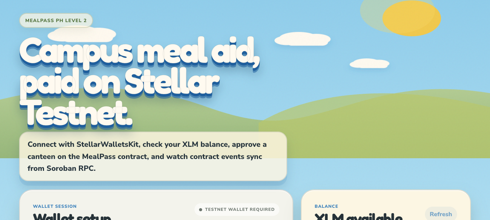
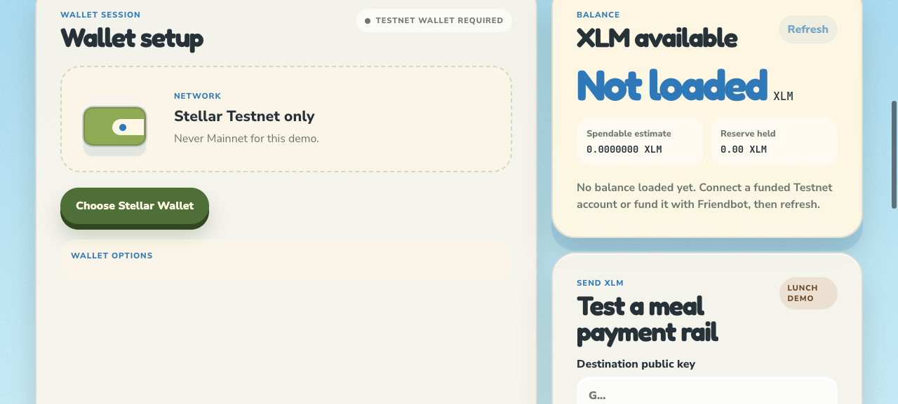
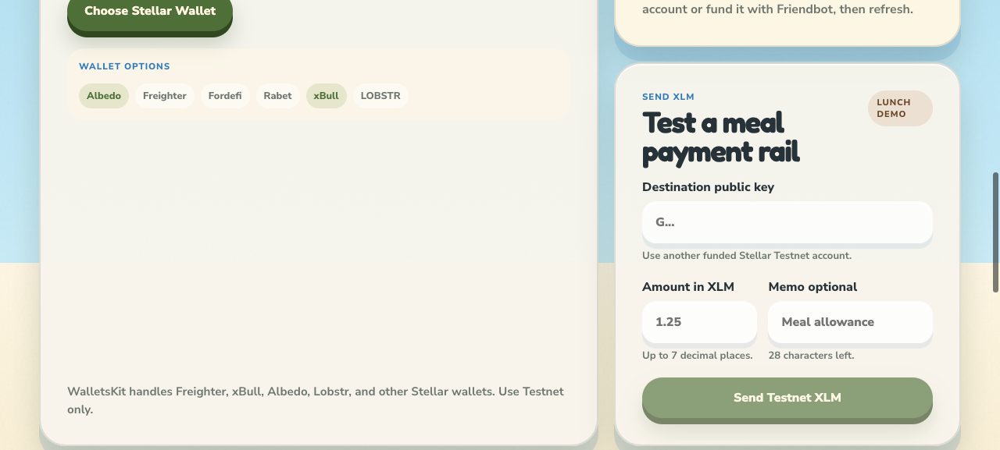

# MealPass PH

MealPass PH is a Stellar Testnet dApp for restricted campus meal aid. A school funds a student's meal allowance, approves canteens, and uses a Soroban smart contract to keep spending auditable.

## Problem

A scholarship student at University of San Carlos Cebu receives ₱500 weekly meal aid in cash, but the school cannot verify it was spent on meals, while nearby carinderias wait days to reconcile paper receipts.

## Solution

The school loads USDC into a Soroban meal allowance contract, the student scans a canteen QR, and the contract releases funds only to approved food merchants with an auditable receipt.

## Screenshots

### Home and wallet dashboard



### Wallet options area



### Contract console and live event feed



### Submission placeholders

Add these before final submission if you redeploy or capture live calls:

```text
Live demo link: TODO
Event-enabled deployed contract address: TODO
Contract call transaction hash: TODO
Wallet modal screenshot: TODO, replace docs/screenshots/wallet-options.png if needed
```

## What This Demonstrates

Level 1:

- Stellar Testnet only.
- Wallet connect and disconnect.
- Connected public key display.
- XLM balance fetch from Horizon Testnet.
- Testnet XLM payment signed by wallet.
- Transaction status, errors, and transaction hash.

Level 2:

- StellarWalletsKit multi-wallet connection.
- Contract deployed to Stellar Testnet.
- Contract read call from frontend: `receipt_count`.
- Contract write call from frontend: `set_merchant`.
- Transaction status tracking during contract calls.
- Contract events emitted by Soroban contract.
- Live event polling from Soroban RPC.
- Three visible error classes: wallet connection, balance/payment, contract call.

## Tech Stack

- Frontend: Vite, React, TypeScript, CSS.
- Package manager: Bun.
- Wallets: StellarWalletsKit.
- Stellar SDK: `@stellar/stellar-sdk`.
- Smart contract: Soroban Rust contract.
- Network: Stellar Testnet only.
- Horizon: `https://horizon-testnet.stellar.org`.
- Soroban RPC: `https://soroban-testnet.stellar.org`.

## Repository Structure

```text
contracts/mealpass_ph/        Soroban smart contract
src/components/               React UI components
src/hooks/                    Wallet and contract hooks
src/lib/                      Stellar, wallet kit, and contract services
docs/screenshots/             README screenshots
```

## Stellar Features Used

- XLM transfers for Level 1 wallet payment demo.
- Soroban smart contracts for MealPass rules.
- StellarWalletsKit for multi-wallet support.
- Horizon Testnet for account balance and payment submission.
- Soroban RPC for contract calls, state reads, and event polling.
- Trustlines for real USDC flow when using a deployed USDC asset contract.

## Smart Contract Functions

| Function | Type | Purpose |
| --- | --- | --- |
| `initialize(admin, token)` | Write | Stores school admin and settlement token. |
| `set_merchant(admin, merchant, approved)` | Write | Approves or removes a canteen merchant. |
| `fund_student(admin, student, amount)` | Write | Transfers token into contract and credits student allowance. |
| `pay_meal(student, merchant, amount)` | Write | Pays approved merchant and records receipt. |
| `receipt_count()` | Read | Returns latest receipt id. |
| `allowance(student)` | Read | Returns remaining student allowance. |
| `is_merchant(merchant)` | Read | Checks merchant approval. |
| `receipt(id)` | Read | Returns stored receipt details. |

## Contract Events

The event-enabled contract emits:

```text
mealpass / merchant  when a canteen is approved or removed
mealpass / funded    when a student allowance is funded
mealpass / paid      when a student meal payment succeeds
```

The frontend polls Soroban RPC with `getEvents` and displays recent contract events in the live feed.

## Prerequisites

- Rust stable.
- `wasm32v1-none` target.
- Stellar CLI or Soroban CLI version 27.x.
- Bun.
- A Stellar Testnet wallet supported by StellarWalletsKit, Freighter recommended.
- Funded Stellar Testnet identity.

```bash
rustup target add wasm32v1-none
stellar --version
bun --version
```

## Install

```bash
bun install
```

## Run Locally

```bash
bun dev
```

Open:

```text
http://localhost:5173
```

## Build and Test

```bash
bun run typecheck
bun run build
cargo test
stellar contract build
```

Current checks passed locally:

```text
bun run typecheck: passed
bun run build: passed, Vite reports a bundle size warning
cargo test: passed, 5 tests
stellar contract build: passed
```

## Deploy Contract to Testnet

Build the Wasm:

```bash
stellar contract build
```

Deploy:

```bash
stellar contract deploy \
  --wasm target/wasm32v1-none/release/mealpass_ph.wasm \
  --source school \
  --network testnet
```

Save the returned contract ID:

```bash
CONTRACT_ID=CXXXXXXXXXXXXXXXXXXXXXXXXXXXXXXXXXXXXXXXXXXXXXXXXXXXXXXX
```

Current repository default contract ID:

```text
CBHODUN3XFZLWJFIXYUMAO4KKFBKJIKWMQFLLXQ55BXRWSUIA7A2W2UW
```

Important: the default contract ID may point to the earlier deployed contract. For Level 2 event review, redeploy the event-enabled Wasm and paste the new contract ID into the app.

Event-enabled Wasm hash from the latest build:

```text
6dfae6aed85405dccdfe4ba2e37242287287d9e3eafff171b2fc5806fe7e5833
```

## Initialize Contract

Initialize with the school admin wallet and settlement token contract address:

```bash
stellar contract invoke \
  --id $CONTRACT_ID \
  --source school \
  --network testnet \
  -- initialize \
  --admin GCSCHOOLADMINADDRESS000000000000000000000000000000000000 \
  --token CCUSDCTOKENCONTRACT000000000000000000000000000000000000
```

For a quick demo, the frontend Level 2 panel only needs an initialized contract and a connected admin wallet to call `set_merchant`.

## Sample Contract Calls

Approve a canteen:

```bash
stellar contract invoke \
  --id $CONTRACT_ID \
  --source school \
  --network testnet \
  -- set_merchant \
  --admin GCSCHOOLADMINADDRESS000000000000000000000000000000000000 \
  --merchant GCCANTEENADDRESS0000000000000000000000000000000000000 \
  --approved true
```

Read receipt count:

```bash
stellar contract invoke \
  --id $CONTRACT_ID \
  --source school \
  --network testnet \
  -- receipt_count
```

Fund a student allowance with 5 USDC using 7 decimal token units:

```bash
stellar contract invoke \
  --id $CONTRACT_ID \
  --source school \
  --network testnet \
  -- fund_student \
  --admin GCSCHOOLADMINADDRESS000000000000000000000000000000000000 \
  --student GCSTUDENTADDRESS000000000000000000000000000000000000 \
  --amount 50000000
```

Student pays a canteen 1.50 USDC:

```bash
stellar contract invoke \
  --id $CONTRACT_ID \
  --source student \
  --network testnet \
  -- pay_meal \
  --student GCSTUDENTADDRESS000000000000000000000000000000000000 \
  --merchant GCCANTEENADDRESS0000000000000000000000000000000000000 \
  --amount 15000000
```

## Frontend Manual Test

1. Run `bun dev`.
2. Open the app in a browser with a Stellar wallet installed.
3. Switch the wallet to Testnet.
4. Fund the wallet with Testnet XLM.
5. Click `Choose Stellar Wallet`.
6. Confirm the connected public key appears.
7. Confirm XLM balance loads.
8. Send a small XLM payment to another funded Testnet account.
9. Paste the event-enabled contract ID into the contract field.
10. Connect the school admin wallet used during `initialize`.
11. Enter a canteen merchant public key.
12. Click `Approve merchant`.
13. Confirm the transaction status updates and a transaction hash appears.
14. Confirm the live event feed syncs the contract event.

## Submission Checklist

- Public GitHub repository: ready.
- README with setup instructions: ready.
- Minimum 2 meaningful commits: ready.
- Screenshot of wallet options available: included, replace if you want the modal open.
- Deployed contract address: placeholder for event-enabled redeploy.
- Transaction hash of contract call: placeholder.
- Live demo link: optional placeholder.

## Known Limitations

- The app uses polling for contract events. A websocket or indexer can be added later if needed.
- The default contract ID may not include the latest event changes until redeployed.
- The XLM payment demo is Level 1. MealPass production settlement should use a USDC asset contract and real trustline setup.
- No backend is used. This is intentional because wallet signing, Horizon, and Soroban RPC are enough for the bootcamp requirements.

## License

MIT
